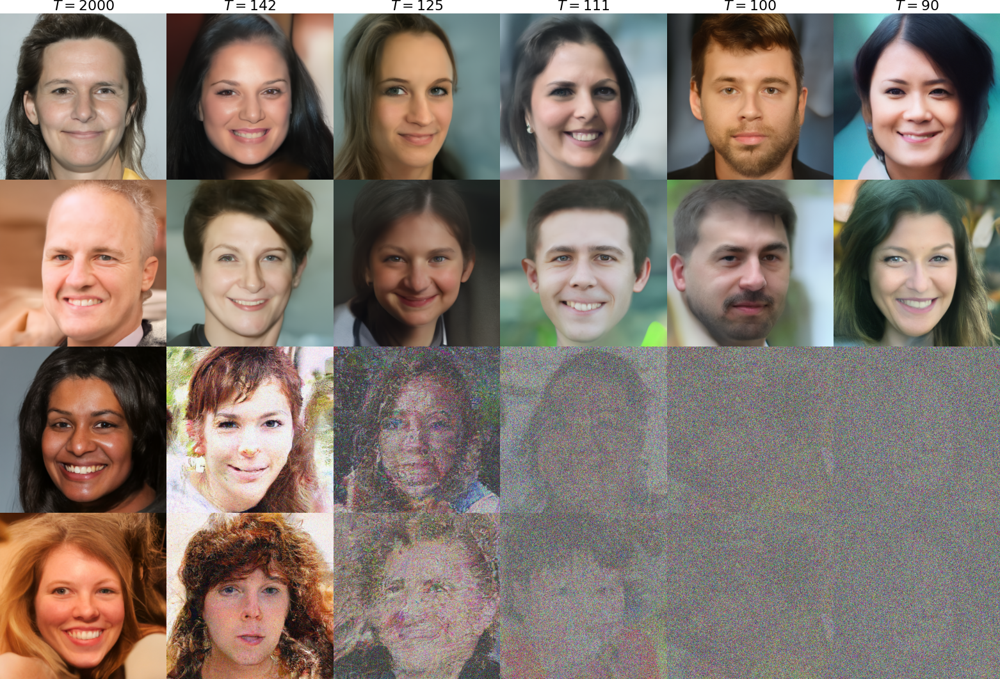
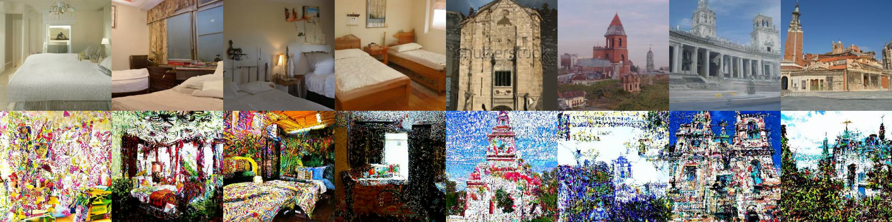
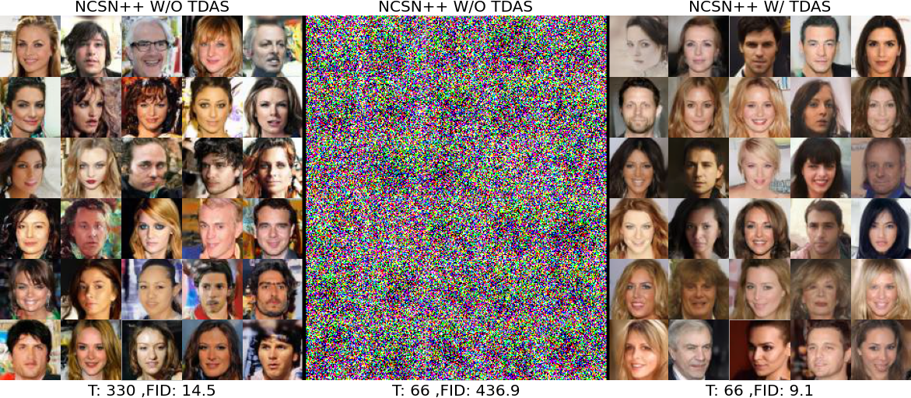
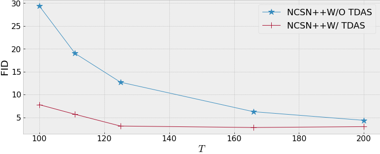

<p align="center">

  <h1 align="center">Accelerating Score-based Generative Models for High-Resolution Image Synthesis</h1>
  <p align="center">
    <a href="">Hengyuan Ma</a>
    ·
    <a href="http://www.robots.ox.ac.uk/~lz/">Li Zhang</a>
    ·
    <a href="https://xiatian-zhu.github.io">Xiatian Zhu</a>
    ·
    <a href="https://zjfheart.github.io/">Jingfeng Zhang</a>
    ·
    <a href="https://www.dcs.warwick.ac.uk/~feng/">Jianfeng Feng</a>

  </p>
  <h3 align="center"><a href="http://arxiv.org/abs/2206.04029">Paper</a> | <a href="https://fudan-zvg.github.io/TDAS">Project Page</a></h3>
  <div align="center"></div>


<p align="center">
Score-based generative models (SGMs) have recently emerged as a promising class of generative models. The key idea is to produce high-quality images by recurrently adding Gaussian noises and gradients to a Gaussian sample until converging to the target distribution, a.k.a.  the diffusion sampling. To ensure stability of convergence in sampling and generation quality, however, this sequential sampling process has to take a small step size and many sampling iterations (e.g., 2000). Several acceleration methods have been proposed with focus on low-resolution generation. In this work, we consider the acceleration of high-resolution generation with SGMs, a more challenging yet more important problem. We prove theoretically that this slow convergence drawback is primarily due to the ignorance of the target distribution. Further, we introduce a novel Target Distribution Aware Sampling (TDAS) method by leveraging the structural priors in space and frequency domains. Extensive experiments on CIFAR-10, CelebA, LSUN, and FFHQ datasets validate that TDAS can consistently accelerate state-of-the-art SGMs, particularly on more challenging high resolution 1024x1024 image generation tasks by up to 18.4x, whilst largely maintaining the synthesis quality. With fewer sampling iterations, TDAS can still generate good quality images. In contrast, the existing methods degrade drastically or even fails completely. 
 </p>

---



High resolution facial images ([FFHQ](https://github.com/NVlabs/ffhq-dataset)) with 1024x1024 resolution generated by [NCSN++](https://github.com/yang-song/score_sde) with TDAS (top two rows) and original [NCSN++](https://github.com/yang-song/score_sde) sampling (bottom two rows) under a variety of sampling iterations T.




Samples ([LSUN](https://www.yf.io/p/lsun) church and bedroom) with 256x256 resolution generated by [NCSN++](https://github.com/yang-song/score_sde) with TDAS (top) and original [NCSN++](https://github.com/yang-song/score_sde) sampling (bottom) under 400 iteration.




Facial images ([CelebA](https://mmlab.ie.cuhk.edu.hk/projects/CelebA.html)) with 64x64 resolution generated on CelebA using [NCSN++](https://github.com/yang-song/score_sde).




Fréchet inception distance (FID) score of NCSN++ with and without TDAS generating on CIFAR-10 under a variety of sampling iterations T.

---


If you find our paper useful, please cite
```bibtex
@article{Ma2022AccelerateSGM,
  author    = {Ma, Hengyuan and Zhang, Li and Zhu, Xiatian and Zhang, Jingfeng and Feng, Jianfeng},
  title     = {Accelerating Score-based Generative Models for High-Resolution Image Synthesis},
  journal   = {arXiv prepreint},
  year      = {2022},
}
```
